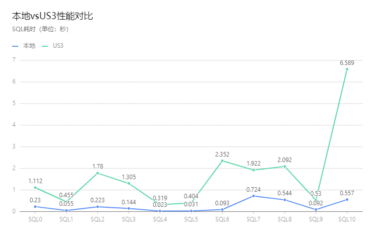

clickhouse是一个用于OLAP的开源列式数据库，Yandex开发。具体介绍可参见[官网](https://clickhouse.tech/docs/zh/).

本分支基于官方版本v20.8.7.15-lts开发；是为了解决clickhouse写入UCloud对象存储US3的问题，增加了clickhouse中disk类型为us3对象存储的支持。

## 新增功能

* disk类型可配置为us3对象存储
  * 支持前缀挂载

## us3存储支持

### 源码下载

* 下载源码

```
git clone https://github.com/us3-epoch/ClickHouse
```

* 切到指定分支

```
git checkout us3_support_v20.8.7.15-lts
```

* 下载依赖的子模块

```
git submodule update --init --recursive
```

### 编译

clickhouse编译依赖gcc/llvm，cmake，ninja。如使用gcc，请确保版本在10及以上。可按[官方说明](https://clickhouse.tech/docs/en/development/build/)准备编译环境。

编译：

```bash
cd ClickHouse
mkdir build
cd build
cmake ..
ninja
```

*注：如使用gcc，请将`cmake ..`替换为`cmake -DENABLE_EMBEDDED_COMPILER=0 -DUSE_INTERNAL_LLVM_LIBRARY=0 -DWERROR=0 ..`

### 配置

如需使用us3作为后端存储，需在配置文件中增加disk配置。配置文件的详细设置请参考[官方链接](https://clickhouse.tech/docs/en/operations/server-configuration-parameters/settings/)

在配置文件的disks中增加如下配置：

```xml
        <disks>
            <your_name>
                <type>us3</type>
                <endpoint>ufile.cn-north-02.ucloud.cn</endpoint>
                <bucket>your-bucket</bucket>
                <access_key>***************</access_key>
                <secret_key>***************</secret_key>
                <prefix>/clickhouse/</prefix>
            </your_name>
        </disks>
```

policies中增加如下配置:

```xml
        <policies>
            <your_name>
                <volumes>
                    <main>
                        <disk>your_disk_name</disk>
                    </main>
                </volumes>
            </your_name>
        </policies>
```

创建表时增加如下语句

```sql
SETTINGS your_setting,
storage_policy = 'your-policy-name';
```

即可创建使用us3作为存储后端的表。

可通过如下命令查看策略是否创建成功。

```
clickhouse-client

select * from system.storage_policies
```

输出如下（省略部分内容）：

```
┌─policy_name─┬─volume_name─┬─volume_priority─┬─disks────────────┬─volume_type─┬─max_data_part_size─┬─move_factor─┐
│ default     │ default     │               1 │ ['default']      │ JBOD        │                  0 │           0 │
│ testpolicy  │ main        │               1 │ ['testdiskname'] │ JBOD        │                  0 │         0.1 │
└─────────────┴─────────────┴─────────────────┴──────────────────┴─────────────┴────────────────────┴─────────────┘
```

## 性能差距

相比使用本地存储，性能上会有一定的损耗，时延大约是本地的8~9倍左右。

通过[官方ontime测试数据集](https://clickhouse.tech/docs/zh/getting-started/example-datasets/ontime/)进行单表测试，测试结果如下：



其中本地测试按照官网步骤执行；US3测试建表语句如下，SQL操作同本地

*US3建表语句*
```sql
CREATE TABLE `ontime_us3` (
  `Year` UInt16,
  `Quarter` UInt8,
  `Month` UInt8,
  `DayofMonth` UInt8,
  `DayOfWeek` UInt8,
  `FlightDate` Date,
  `UniqueCarrier` FixedString(7),
  `AirlineID` Int32,
  `Carrier` FixedString(2),
  `TailNum` String,
  `FlightNum` String,
  `OriginAirportID` Int32,
  `OriginAirportSeqID` Int32,
  `OriginCityMarketID` Int32,
  `Origin` FixedString(5),
  `OriginCityName` String,
  `OriginState` FixedString(2),
  `OriginStateFips` String,
  `OriginStateName` String,
  `OriginWac` Int32,
  `DestAirportID` Int32,
  `DestAirportSeqID` Int32,
  `DestCityMarketID` Int32,
  `Dest` FixedString(5),
  `DestCityName` String,
  `DestState` FixedString(2),
  `DestStateFips` String,
  `DestStateName` String,
  `DestWac` Int32,
  `CRSDepTime` Int32,
  `DepTime` Int32,
  `DepDelay` Int32,
  `DepDelayMinutes` Int32,
  `DepDel15` Int32,
  `DepartureDelayGroups` String,
  `DepTimeBlk` String,
  `TaxiOut` Int32,
  `WheelsOff` Int32,
  `WheelsOn` Int32,
  `TaxiIn` Int32,
  `CRSArrTime` Int32,
  `ArrTime` Int32,
  `ArrDelay` Int32,
  `ArrDelayMinutes` Int32,
  `ArrDel15` Int32,
  `ArrivalDelayGroups` Int32,
  `ArrTimeBlk` String,
  `Cancelled` UInt8,
  `CancellationCode` FixedString(1),
  `Diverted` UInt8,
  `CRSElapsedTime` Int32,
  `ActualElapsedTime` Int32,
  `AirTime` Int32,
  `Flights` Int32,
  `Distance` Int32,
  `DistanceGroup` UInt8,
  `CarrierDelay` Int32,
  `WeatherDelay` Int32,
  `NASDelay` Int32,
  `SecurityDelay` Int32,
  `LateAircraftDelay` Int32,
  `FirstDepTime` String,
  `TotalAddGTime` String,
  `LongestAddGTime` String,
  `DivAirportLandings` String,
  `DivReachedDest` String,
  `DivActualElapsedTime` String,
  `DivArrDelay` String,
  `DivDistance` String,
  `Div1Airport` String,
  `Div1AirportID` Int32,
  `Div1AirportSeqID` Int32,
  `Div1WheelsOn` String,
  `Div1TotalGTime` String,
  `Div1LongestGTime` String,
  `Div1WheelsOff` String,
  `Div1TailNum` String,
  `Div2Airport` String,
  `Div2AirportID` Int32,
  `Div2AirportSeqID` Int32,
  `Div2WheelsOn` String,
  `Div2TotalGTime` String,
  `Div2LongestGTime` String,
  `Div2WheelsOff` String,
  `Div2TailNum` String,
  `Div3Airport` String,
  `Div3AirportID` Int32,
  `Div3AirportSeqID` Int32,
  `Div3WheelsOn` String,
  `Div3TotalGTime` String,
  `Div3LongestGTime` String,
  `Div3WheelsOff` String,
  `Div3TailNum` String,
  `Div4Airport` String,
  `Div4AirportID` Int32,
  `Div4AirportSeqID` Int32,
  `Div4WheelsOn` String,
  `Div4TotalGTime` String,
  `Div4LongestGTime` String,
  `Div4WheelsOff` String,
  `Div4TailNum` String,
  `Div5Airport` String,
  `Div5AirportID` Int32,
  `Div5AirportSeqID` Int32,
  `Div5WheelsOn` String,
  `Div5TotalGTime` String,
  `Div5LongestGTime` String,
  `Div5WheelsOff` String,
  `Div5TailNum` String
) ENGINE = MergeTree
PARTITION BY Year
ORDER BY (Carrier, FlightDate)
SETTINGS index_granularity = 8192,
storage_policy = 'us3';
```
